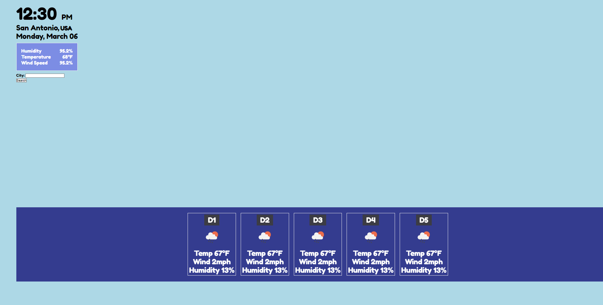

# Module_6_Weather_Dashboard
This is an application that integrates a third party weather API to display the 5 day forecast for weather for certain cities. 

## Description
This project will show the current weather, location and date. It will also show the future 5 day forecast of the weather. It will allow a user to 
search a city the populate the corresponsing infomration. It will store the previous searches and display them. 

## Usage
When the page is loaded, the user inputs a location and the weather infomration is displayed. 

## Credits

 [Repository](https://github.com/danieltran2016/Module_6_Weather_Dashboard)

[Site](https://danieltran2016.github.io/Module_6_Weather_Dashboard/)